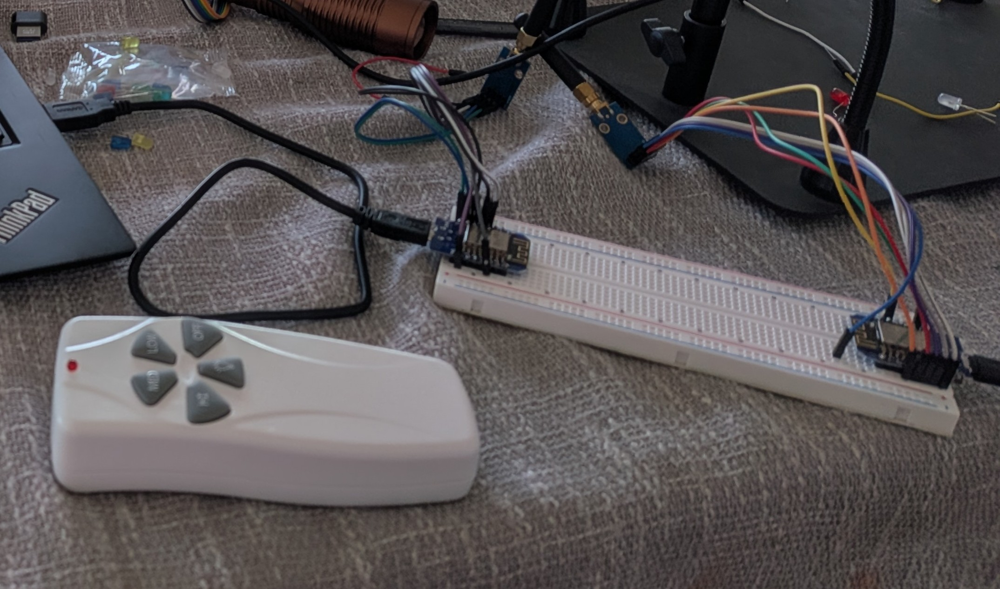

# esp8266-fan-remote

WiFi-controlled ceiling fan remote using an ESP8266 and CC1101 433 MHz transceiver.
Replays captured OOK RF codes to control a RHINE UC7070T ceiling fan over HTTP and via Alexa.



*Left to right: the original UC7070T remote, the TX prototype (sends fan commands over WiFi), and the RX prototype (captures raw OOK pulses for protocol analysis).*

## Hardware

| Component | Notes |
|-----------|-------|
| [ESP8266](https://www.amazon.com/dp/B081PX9YFV) | Generic board (e.g. Wemos D1 Mini, NodeMCU) |
| [CC1101 E07-M1101D](https://www.amazon.com/dp/B0GYWFJ9KX) | 303 MHz OOK transceiver module |

## Wiring

The CC1101 module has a 2×4 pin grid. Pins 1,3,5,7 are the left column; 2,4,6,8 are the right.

```
  ESP8266                CC1101                     ESP8266
  ───────────────────────────────────────────────────────────
  GND             ──── 1 │ GND    VCC │ 2 ────  3.3V
  D2  (GPIO  4)   ──── 3 │ GDO0   CSN │ 4 ────  D8 (GPIO 15)
  D5  (GPIO 14)   ──── 5 │ SCK   MOSI │ 6 ────  D7 (GPIO 13)
  D6  (GPIO 12)   ──── 7 │ MISO  GDO2 │ 8        (not connected)
  ───────────────────────────────────────────────────────────
```

> **Important:** Power the CC1101 from the ESP8266's **3.3 V** rail only. 5 V will damage it.

## Dependencies

Install via Arduino Library Manager:

- **ELECHOUSE CC1101** — search `ELECHOUSE CC1101`
  ([SmartRC-CC1101-Driver-Lib](https://github.com/LSatan/SmartRC-CC1101-Driver-Lib))
- **Espalexa** — search `Espalexa` (required for Alexa control)
- **ESP8266 board support** — search `esp8266` in Boards Manager
  (URL: `http://arduino.esp8266.com/stable/package_esp8266com_index.json`)

### Required Espalexa library patch

Newer Alexa firmware collapses all devices into the first one unless you patch
`Espalexa.h` ([espalexa issue #231](https://github.com/Aircoookie/Espalexa/issues/231)).

Open `~/Arduino/libraries/Espalexa/src/Espalexa.h` and find `encodeLightId()` (~line 125).
Change the `sprintf_P` format string from:

```cpp
// Original (broken — Alexa treats all devices as one):
sprintf_P(out, PSTR("%02X:%02X:%02X:%02X:%02X:%02X:00:11-%02X"), mac[0],mac[1],mac[2],mac[3],mac[4],mac[5], idx);
```

to:

```cpp
// Patched (each device gets a unique ID):
sprintf_P(out, PSTR("%02X:%02X:%02X:%02X:%02X:%02X-%02X-00:11"), mac[0],mac[1],mac[2],mac[3],mac[4],mac[5], idx);
```

**This patch must be reapplied after every Espalexa library update.**

## Setup

1. Copy `fan_remote/secrets.h.example` to `fan_remote/secrets.h` and fill in your WiFi credentials.
2. Open `fan_remote/fan_remote.ino` in Arduino IDE.
3. Set board to **Generic ESP8266 Module**.
4. Flash to the ESP8266.
5. Open Serial Monitor (115200 baud) — the assigned IP is printed on boot.

## HTTP endpoints

Navigate to `http://<ip>/` for the web UI, or call endpoints directly:

| Endpoint        | Action                        |
|-----------------|-------------------------------|
| `/`             | Web control page              |
| `/hi`           | Fan high speed                |
| `/med`          | Fan medium speed              |
| `/low`          | Fan low speed                 |
| `/off`          | Fan off                       |
| `/light`        | Toggle light on/off           |
| `/carrier`      | 3 s continuous RF carrier test |
| `/dumpregs`     | Read key CC1101 registers     |
| `/status`       | Timing constants + register readback |

The `/carrier` endpoint transmits a continuous 303.92 MHz carrier for 3 seconds.
Use it to verify RF emission: the physical remote should fail to operate the fan
during that window if the CC1101 is transmitting.

## Alexa control

The firmware exposes five Alexa devices via Espalexa (Philips Hue bridge emulation):

| Alexa device name   | Action          |
|---------------------|-----------------|
| Bedroom Fan High    | Fan high speed  |
| Bedroom Fan Medium  | Fan medium speed |
| Bedroom Fan Low     | Fan low speed   |
| Bedroom Fan Off     | Fan off         |
| Bedroom Light       | Toggle light    |

Say *"Alexa, turn on Bedroom Fan High"*, *"Alexa, turn off Bedroom Light"*, etc.

After flashing, say *"Alexa, discover devices"* or use the Alexa app to run device discovery.
If all commands trigger the same device, recheck that the Espalexa patch above was applied.

## How it works

The firmware replays captured OOK frames through the CC1101's TX FIFO at 303.92 MHz.
Each command is a 13-pulse, position-encoded frame repeated multiple times with 8 ms gaps.

**CC1101 OOK gating requires correct PATABLE setup:**
- `PATABLE[0] = 0x00` — OOK=0 state → PA off (carrier silence)
- `PATABLE[1] = 0xC0` — OOK=1 state → PA at ~10 dBm
- `FREND0 = 0x11` — routes OOK=1 to PATABLE[1]

Without this, the PA drives full carrier in both the on and off states and no modulation reaches the fan.

## Target fan

RHINE UC7070T ceiling fan, DIP switch address `E7 80 29`.
See [SPEC.md](SPEC.md) for full protocol details and how to adapt for other addresses.
