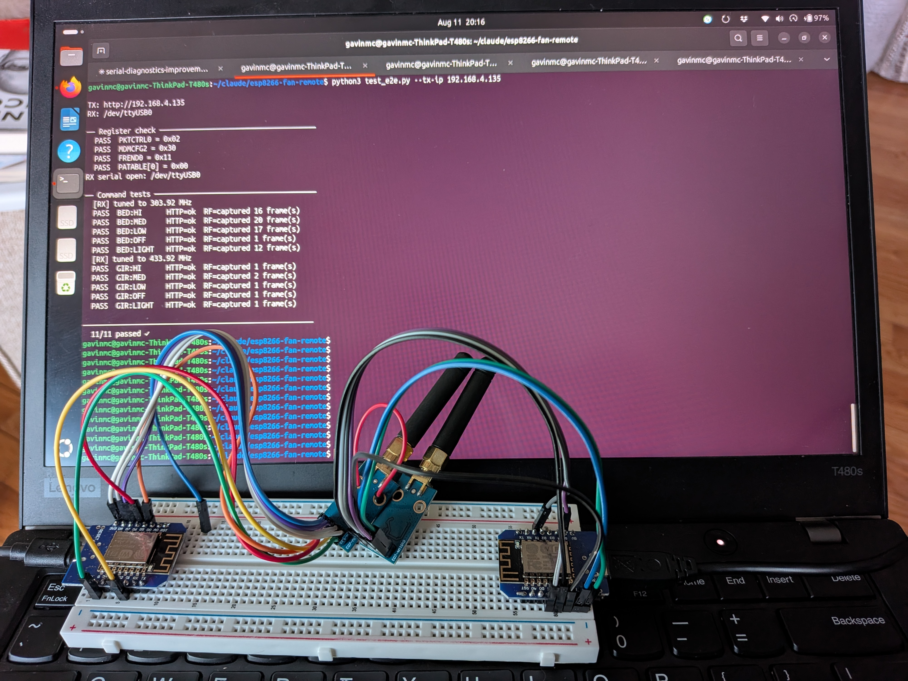

# esp8266-fan-remote

WiFi and Alexa control for RF ceiling fans, using an ESP8266 and CC1101 transceiver.
Replays captured OOK RF codes over HTTP and Alexa (Philips Hue emulation).

## Supported fans

| Remote | Frequency | Compatible fans |
|--------|-----------|-----------------|
| Rhine UC7070T | 303.92 MHz | **Hampton Bay** (Home Depot) and **Harbor Breeze** (Lowe's) ceiling fans. Both brands are made by King of Fans and share the same RF protocol. The UC7070T is a widely available replacement remote for this family. |
| SMC-5060-RF | 433.92 MHz | SMC 5060RF ceiling fans (DIP-switch addressed). |

Hampton Bay (Home Depot) and Harbor Breeze (Lowe's) are both made by King of Fans and
share the same RF protocol, making this one of the most common ceiling fan families in
North America. If your fan came with a remote that looks like the UC7070T, or if the
UC7070T is listed as a compatible replacement, this firmware will very likely work for you.

The single CC1101 module switches frequency per-command, so multiple fans at different
frequencies can be controlled from one ESP8266.


*Left to right: the original UC7070T remote, the TX prototype (sends fan commands over WiFi), and the RX prototype (captures raw OOK pulses for protocol analysis).*

## Hardware

| Component | Notes |
|-----------|-------|
| [ESP8266](https://www.amazon.com/dp/B081PX9YFV) | Generic board (e.g. Wemos D1 Mini, NodeMCU) |
| [CC1101 E07-M1101D](https://www.amazon.com/dp/B0GYWFJ9KX) | 303 MHz OOK transceiver module |

## Wiring

The CC1101 module has a 2×4 pin grid. Pins 1,3,5,7 are the left column; 2,4,6,8 are the right.

```
  ESP8266                CC1101                     ESP8266
  ───────────────────────────────────────────────────────────
  GND             ──── 1 │ GND    VCC │ 2 ────  3.3V
  D2  (GPIO  4)   ──── 3 │ GDO0   CSN │ 4 ────  D8 (GPIO 15)
  D5  (GPIO 14)   ──── 5 │ SCK   MOSI │ 6 ────  D7 (GPIO 13)
  D6  (GPIO 12)   ──── 7 │ MISO  GDO2 │ 8        (not connected)
  ───────────────────────────────────────────────────────────
```

> **Important:** Power the CC1101 from the ESP8266's **3.3 V** rail only. 5 V will damage it.

## Dependencies

Install via Arduino Library Manager:

- **ELECHOUSE CC1101** — search `ELECHOUSE CC1101`
  ([SmartRC-CC1101-Driver-Lib](https://github.com/LSatan/SmartRC-CC1101-Driver-Lib))
- **Espalexa** — search `Espalexa` (required for Alexa control)
- **ESP8266 board support** — search `esp8266` in Boards Manager
  (URL: `http://arduino.esp8266.com/stable/package_esp8266com_index.json`)

### Required Espalexa library patch

Newer Alexa firmware collapses all devices into the first one unless you patch
`Espalexa.h` ([espalexa issue #231](https://github.com/Aircoookie/Espalexa/issues/231)).

Open `~/Arduino/libraries/Espalexa/src/Espalexa.h` and find `encodeLightId()` (~line 125).
Change the `sprintf_P` format string from:

```cpp
// Original (broken — Alexa treats all devices as one):
sprintf_P(out, PSTR("%02X:%02X:%02X:%02X:%02X:%02X:00:11-%02X"), mac[0],mac[1],mac[2],mac[3],mac[4],mac[5], idx);
```

to:

```cpp
// Patched (each device gets a unique ID):
sprintf_P(out, PSTR("%02X:%02X:%02X:%02X:%02X:%02X-%02X-00:11"), mac[0],mac[1],mac[2],mac[3],mac[4],mac[5], idx);
```

**This patch must be reapplied after every Espalexa library update.**

## Configuration

Device configuration is split across two files:

### `model_database.json`

Describes each supported fan model — protocol, frequency, timing constants, and default
command N values. Add an entry here when supporting a new model. This file is shared and
committed to the repo.

### `devices.json` (local, gitignored)

Lists your specific devices. Each entry names a model from `model_database.json` and
provides your Alexa device names and URL paths. For models with DIP-switch addressing
(e.g. SMC_5060_RF) you also supply the N value for each command matching your switch
setting; for models with fixed N values (e.g. RHINE_UC7070T) no command overrides are
needed.

Copy `devices.json.example` to `devices.json` and edit it for your installation:

```bash
cp devices.json.example devices.json
```

Minimal entry for a fixed-N model (Hampton Bay / Rhine UC7070T):

```json
{
  "name":  "Bedroom",
  "path":  "bedroom",
  "model": "RHINE_UC7070T",
  "alexa": {
    "hi": "Bedroom Fan High", "med": "Bedroom Fan Medium",
    "low": "Bedroom Fan Low", "off": "Bedroom Fan Off", "light": "Bedroom Light"
  }
}
```

Entry for a DIP-addressed model (SMC 5060RF) — N values depend on your DIP switch
setting; these are for switches 1–4 = OFF ON OFF ON:

```json
{
  "name":  "Girls",
  "path":  "girls",
  "model": "SMC_5060_RF",
  "commands": {
    "hi": {"N": 4}, "med": {"N": 3}, "low": {"N": 0},
    "off": {"N": 5}, "light": {"N": 1}
  },
  "alexa": {
    "hi": "Girls Fan High", "med": "Girls Fan Medium",
    "low": "Girls Fan Low", "off": "Girls Fan Off", "light": "Girls Light"
  }
}
```

## Setup

1. Copy `fan_remote/secrets.h.example` to `fan_remote/secrets.h` and fill in your WiFi credentials.
2. Copy `devices.json.example` to `devices.json` and edit for your fans (see Configuration above).
3. Open `fan_remote/fan_remote.ino` in Arduino IDE.
4. Set board to **Generic ESP8266 Module**.
5. Flash to the ESP8266.
6. Open Serial Monitor (115200 baud) — the assigned IP is printed on boot.

## HTTP endpoints

Navigate to `http://<ip>/` for the web UI, or call endpoints directly:

**Bedroom fan (303.92 MHz):**

| Endpoint          | Action              |
|-------------------|---------------------|
| `/<devicename>/hi`     | Fan high speed      |
| `/<devicename>/med`    | Fan medium speed    |
| `/<devicename>/low`    | Fan low speed       |
| `/<devicename>/off`    | Fan off             |
| `/<devicename>/light`  | Toggle light on/off |

**Shared:**

| Endpoint        | Action                        |
|-----------------|-------------------------------|
| `/`             | Web control page (both fans)  |
| `/carrier`      | 3 s continuous RF carrier test (303 MHz) |
| `/dumpregs`     | Read key CC1101 registers     |
| `/status`       | Timing constants + register readback |

The `/carrier` endpoint transmits a continuous 303.92 MHz carrier for 3 seconds.
Use it to verify RF emission: the physical remote should fail to operate the fan
during that window if the CC1101 is transmitting.

## Alexa control

The firmware exposes ten Alexa devices via Espalexa (Philips Hue bridge emulation):

| Alexa device name   | Action               |
|---------------------|----------------------|
| Bedroom Fan High    | Bedroom fan high     |
| Bedroom Fan Medium  | Bedroom fan medium   |
| Bedroom Fan Low     | Bedroom fan low      |
| Bedroom Fan Off     | Bedroom fan off      |
| Bedroom Light       | Bedroom light toggle |

Say *"Alexa, turn on Bedroom Fan High"*, *"Alexa, turn off Bedroom Light"*, etc.

After flashing, say *"Alexa, discover devices"* or use the Alexa app to run device discovery.
If all commands trigger the same device, recheck that the Espalexa patch above was applied.

## End-to-end testing

`test_e2e.py` fires every HTTP command at the TX unit and verifies the response, while
optionally using a second ESP8266+CC1101 running `capture/capture.ino` to confirm RF
is actually being transmitted.

### Hardware needed

| Unit | Sketch | Module |
|------|--------|--------|
| TX   | `fan_remote/` | E07-M1101D (wideband) |
| RX (optional) | `capture/` | any CC1101; wideband recommended for 433 MHz |

Connect both to the host machine via USB.

### Build and flash

```bash
# TX unit
./build.sh

# Capture unit — identify its port first, then:
~/bin/arduino-cli compile --fqbn esp8266:esp8266:generic capture
~/bin/arduino-cli upload  --fqbn esp8266:esp8266:generic --port /dev/ttyUSB0 capture
```

Or flash both at once (adjust ports as needed):

```bash
~/bin/arduino-cli upload --fqbn esp8266:esp8266:generic --port /dev/ttyUSB1 fan_remote &
~/bin/arduino-cli upload --fqbn esp8266:esp8266:generic --port /dev/ttyUSB0 capture   &
wait
```

To identify which port is which, check Serial output:
```bash
# The capture unit prints [RSSI] lines; the TX unit does not
python3 -c "
import serial, time
for p in ['/dev/ttyUSB0', '/dev/ttyUSB1']:
    s = serial.Serial(p, 115200, timeout=0.5)
    d = s.read(256).decode(errors='replace'); s.close()
    print(p, 'CAPTURE' if '[RSSI]' in d else 'TX/other')
"
```

### Run the test

```bash
pip install pyserial   # if not already installed

python3 test_e2e.py --tx-ip 192.168.4.135
```

The RX port is auto-detected. To specify it explicitly:

```bash
python3 test_e2e.py --tx-ip 192.168.4.135 --rx-port /dev/ttyUSB0
```

The script:
1. Checks key CC1101 registers via `/status`
2. Fires all 10 commands (5 Bedroom + 5 Girls) and checks HTTP responses
3. Sends `FREQ 303.92` / `FREQ 433.92` over serial to retune the capture unit
   between device batches, then checks for an RSSI spike above −70 dBm

Without the capture unit connected, steps 1 and 2 still run; step 3 is skipped.

### Sample output

```
TX: http://192.168.4.135
RX: /dev/ttyUSB0

── Register check ──────────────────────────────────────
  PASS  PKTCTRL0 = 0x02
  PASS  MDMCFG2 = 0x30
  PASS  FREND0 = 0x11
  PASS  PATABLE[0] = 0x00
RX serial open: /dev/ttyUSB0

── Command tests ───────────────────────────────────────
  [RX] tuned to 303.92 MHz
  PASS  BED:HI      HTTP=ok  RF=captured 16 frame(s)
  PASS  BED:MED     HTTP=ok  RF=captured 20 frame(s)
  PASS  BED:LOW     HTTP=ok  RF=captured 17 frame(s)
  PASS  BED:OFF     HTTP=ok  RF=captured 1 frame(s)
  PASS  BED:LIGHT   HTTP=ok  RF=captured 12 frame(s)
  [RX] tuned to 433.92 MHz
  PASS  GIR:HI      HTTP=ok  RF=captured 1 frame(s)
  PASS  GIR:MED     HTTP=ok  RF=captured 2 frame(s)
  PASS  GIR:LOW     HTTP=ok  RF=captured 1 frame(s)
  PASS  GIR:OFF     HTTP=ok  RF=captured 1 frame(s)
  PASS  GIR:LIGHT   HTTP=ok  RF=captured 1 frame(s)

───────────────────────────────────────────────────────
  11/11 passed ✓
```

The capture unit's E07-M1010 module is rated 300–348 MHz so 433 MHz reception is
marginal — touch the two antennas together when testing Girls fan commands.



### Tuning the capture unit frequency manually

The capture unit accepts serial commands at 115200 baud:

```
FREQ 433.92    ← retune to Girls fan band
FREQ 303.92    ← retune to Bedroom fan band
```

Send via any serial terminal, or with Python:
```python
import serial
s = serial.Serial('/dev/ttyUSB0', 115200)
s.write(b'FREQ 433.92\n')
```

## How it works

The firmware replays captured OOK frames through the CC1101's TX FIFO at 303.92 MHz.
Each command is a 13-pulse, position-encoded frame repeated multiple times with 8 ms gaps.

**CC1101 OOK gating requires correct PATABLE setup:**
- `PATABLE[0] = 0x00` — OOK=0 state → PA off (carrier silence)
- `PATABLE[1] = 0xC0` — OOK=1 state → PA at ~10 dBm
- `FREND0 = 0x11` — routes OOK=1 to PATABLE[1]

Without this, the PA drives full carrier in both the on and off states and no modulation reaches the fan.

## How to add new remote support

The protocol reverse engineering process is helped enormously by an AI agent, such as Claude Code.

1. Take a breadboard and mount two ESP3266 modules, wire each one to its own CC1101 transceiver.
2. Determine what frequency your remote works under.  Set the code in capture and fan_remote to use the frequency.
3. Flash one ESP3266 with the capture/capture.ino (a receiver).  Flash the other esp3266 with fan_remote/fan_remote.ino (the tranmsmitter).
4. Once both are working, run capture and press each button on the remote. Store the result and pass to the AI.
5. Give the AI control over both the capture and fan_remote units and allow it
   to update and reflash until it succeeds in matching the original remote.


## Tested fans

See [SPEC.md](SPEC.md) for full protocol details on both fans.

| Model       | DIP address | Notes |
|-------------|-------------|-------|
| RHINE UC7070T | `E7 80 29`         | 303.92 MHz |
| SMC-5060-RF   | `OFF ON OFF ON` (sw 1–4) | 433.92 MHz |

> **DIP switch encoding:** The address is not an explicit field in the frame. Changing the DIP
> switch changes which N value the remote transmits for each command — the receiver only responds
> to the N values matching its own DIP setting. Each fan's firmware is hard-coded to the N values
> captured from its specific remote. To support a different DIP setting, re-capture the remote
> with `capture/capture.ino` and compare the N values.
